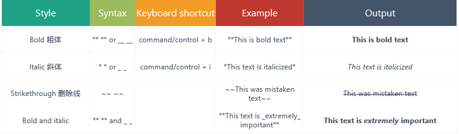
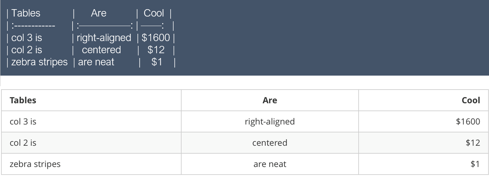

# Markdown 使用说明 #
中文说明 [http://wowubuntu.com/markdown/#list](http://wowubuntu.com/markdown/#list "中文说明")

### (一) 标题

### (二) 列表 

### (三) 引用 #

### (四) 代码

### (五) 图片/链接 
#### 1. 图片
* ``
* `![Alt text][id]`,[id]是图片参考的名称
* 地址可以本地，也可以网络(http://i.imgur.com/WZ7Ohkp.jpg)，云床 (https://www.getcloudapp.com/)

#### 2. 链接
* `[baidu](www.baidu.com "提示信息")`
* `[baidu] [1]`

    >链接说明：
    >    *链接辨别标签可以有字母、数字、空白和标点符号
    >    *在其他地方定义1的链接，eg `[1]: https://www.baidu.com "提示信息"`

* 用相对路径 
* `<http://example.com/> 直接链接`

##### 效果
* [中文使用说明](http://wowubuntu.com/markdown/#list "提示信息")
* [baidu用链接](https://www.baidu.com "title")
* [baidu用序号] [1]
[1]: https://www.baidu.com

#### 3. 页内跳转 
* 使用markdown语法：`[点击跳转](#jump)`
  定义一个锚(id)：`跳转到的地方`
* 目录：`[1.语法示例](#1)`
  文章内位置：`<h2 id="1">1.语法示例</h2>`
  
##### 效果

[附录](#jump)

### (六) 文本格式

### (七) 表格 

### (八) 分割线

### (九) 目录 

* `[TOC]`

### (十) 反义字符 -转义
- Markdown 可以利用反斜杠来插入一些在语法中有其它意义的符号。

### (十一) 任务 

附录