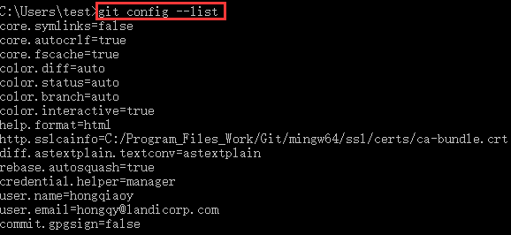
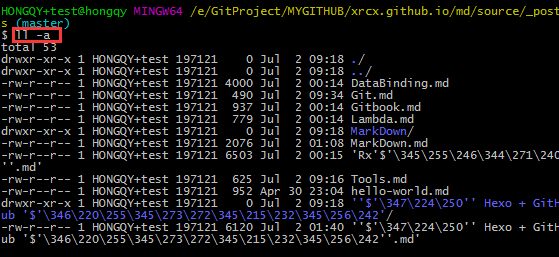
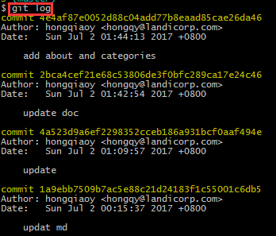
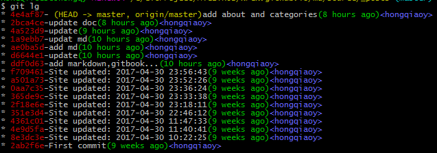

 # [Git](https://git-for-windows.github.io/)
## 学习
### 资料
1. [Git 权威指南（中文版）](http://git0scm.com/book/zh/v1/)，最权威的指南
2. [Git Community Book(中文版)](htp://gitbook.liiuhui998.com/)
3. [WiKi 的 Git 主页](https://git.wiki.kernel.or/index.php/Main_page/),深入研究时再去翻阅
4. [图解 Git 最好的网站](http://marklodoto.github.io/visual-git-guide/index-zh-cn.html)

### 工具
1. [Git dojo](https://www.shortcutfoo.com/app/dojos/git),一个练习[快捷键网站](https://www.shortcutfoo.com/)的子项目
2. [15分钟练习 Git](https://try.github.io/levels/1/challenges/1)
3. LernGitBranching

## 区域
1. 工作区，开发者修改代码区域，working tree
2. 暂存区，保存各个版本的区域，git add/commit 到暂存区
3. 历史区，index

## 文件
1. 项目的配置信息, `.git/config`


## SSH Key
1. 创建 SSH KEY,`ssh-keyygen -t rsa -C "xrcx@163.com"`,会生成 id_rsa , id_rsa.pub文件，SSH Key 的密钥对。
    + id_rsa , 私钥, 验证自己身份。
    + id_rsa.pub , 公钥, 用在git远程服务器上表明自己身份。
2. 将 id_rsa.pub 内容复制到 Github 服务器 SSH Keys。

## 指令
1. 查看版本,`git --version`
2. 当前 git 配置信息, `git config --list`
    
3. 显示通用配置信息, `git config --list --global`
4. 显示指定配置名的配置信息, `git config user.name`
5. 配置参数名, `git config --global user.name xrcx`,
               `git config --global --add user.name xrcx user.email xrcx@163.com`
6. 删除配置信息, `git config --global --unset user.name xrcx`
7. 显示项目的所有文件, `ll -a`
    
8. 配置别名, `git config --global alias.st status`
   eg: `git config --global alias.lg "log --color --graph --pretty=format:'%Cred%h%Creset-%C(yellow)%d%Creset%s%Cgreen(%cr)%C(bold blue)<%an>%Creset' --abbrev-commit"`
    
    
9. 删除文件，`git rm fileName`,省去 git add 操作

## 日志
1. `git shortlog`, 查看并统计提交记录
2. `git log`，查看日志,详细提交信息，不包括追加提交，撤销记录等
3. `git lg`
4. `git reflog`，查看所有提交记录


## 创建仓库
1. 创建仓库, `git init`
2. 克隆项目, `git clone git@github.com:xuxuxu/testGit.git` 
- SSH 协议，通过对称加密秘钥来验证
- Https方式，要检验用户名和密码

## 提交修改
3. 查看仓库状态, git status
4. 创建文件, `touch fileName`，状态 `Untracked`
5. 添加版本控制, `git add fileName`, 状态 `Added` ，`Stage`
6. 提交, `git commit -m 'add file'`,
7. 追加修改, `git commit --amend -m "add test2"`,可通过修改commit，纠正前一个错误的commit
    + `git diff fileName` ,比较指定文件差异
    + `git diff HEAD`，比较提交节点差异
9. 指定文件历史修改记录，`git blame fileName`

## 回退 check out && reset
1. `git checkout fileName`
    + git add 前，撤销本地修改，到最后 commit 的状态
    + git add 后, 撤掉到最后 add 的状态
2. `git reset --hard HEAD^`,回到上个提交版本

## 暂存 stash
2. 文件暂存，`git stash`
3. 查看当前暂存内容，`git stash list`
4. 恢复暂存内容，`git stash apply stash@{0}`,`git stash pop`

## pull && push
1. 将本地代码添加到远程仓库, `git remote add origin url` ,其中 `origin` 是远程仓库的名字
2. 将修改推动到远程仓库，`git push -u origin master`(第一次)或者 `git push`，其中 -u 参数，还会把本地和远程 master 分支关联起来。
3. 推送分支，`git push origin dev`，把dev分支推送到远程origin仓库中
4. 推送 Tag，
    + `git push origin version1`
    + `git push origin --tags`,推送所有的本地 Tag 
    + `git push origin :refs/tags/version0` ,删除本地 Tag后推送到服务器
5. 避免多余 Merge History，`git pull --rebase` 不用 `git pull` 

# 分支管理
1. master 分支，进行发布管理，用于打 Tag 和发布 release,保证发布出去的版本一定是完善的,已验证过的。
2. develop 分支，进行开发

## 操作
1. 创建分支，`git checkout -b dev`
    + -b 参数，使分支创建并自动切换
    + dev 是分支名称
    + 等价 
        ``` java
        git branch dev
        git checkout dev
        ```
    + **如果分支中有未提交的修改，先用`git stash` 暂存内容，再切换分支**
2. 查看分支，`git branch`
    + -r，可列出所有远程分支
    + -a，列举出所有本地和远程分支
3. 查看远程分支，`got remote`,查看详细信息，`git remote -v`
4. 
3.合并分支，比如，要把 dev 分支合并到 master，在 master 分支上 merge 代码，`git merge dev`
    + merge，操作后，时间线不会合并，保存了完整的git提交记录
    + rebase，操作后git时间线会被进行合并，让时间线更干净
4. 删除分支，`git branch -d dev`，就算没合并也要删除，强制删除，`git branch -D dev`

# Tag
类似branch，不可以改变，Merge，用于记录某个 commit点或分支的历史快照。通常打在Master分支上，以保证代码的准确性。

## 操作
1. 创建 Tag
    + `git tag version1`
    + `git tag version0 b687b098`，指定ID
    + `git tag -a V1 -m "version1" b78997a09e80c9b807d87`，创建带标签的 Tag，`-a` 指定 Tag 名，`-m`，指定注释文字
2. 查看 Tag
- `git tag`
- `git show tagName`，查看指定 Tag 的详细信息
3. 删除 Tag，
- `git tag -d version0`，删除本地 Tag
-  删除远程 Tag，先删除本地 Tag，在Push 到远程仓库 `git push origin :refs/tags/version0`

